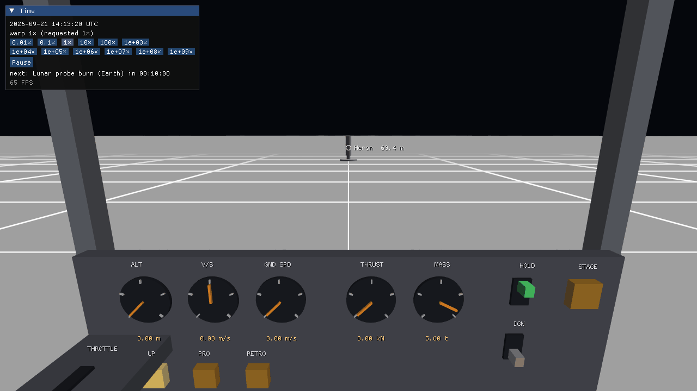
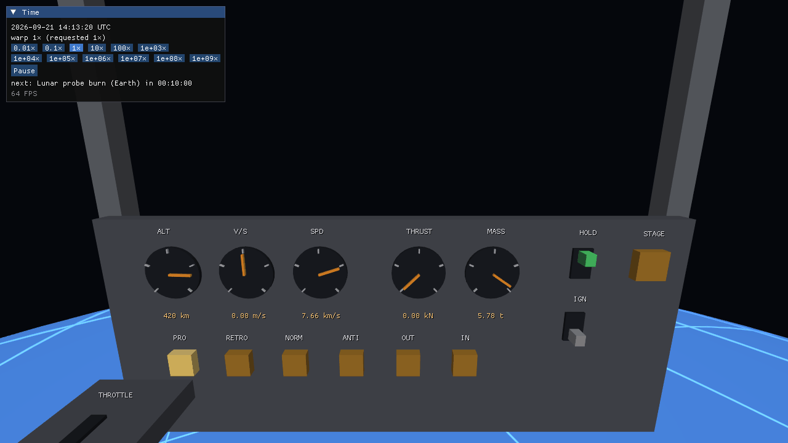
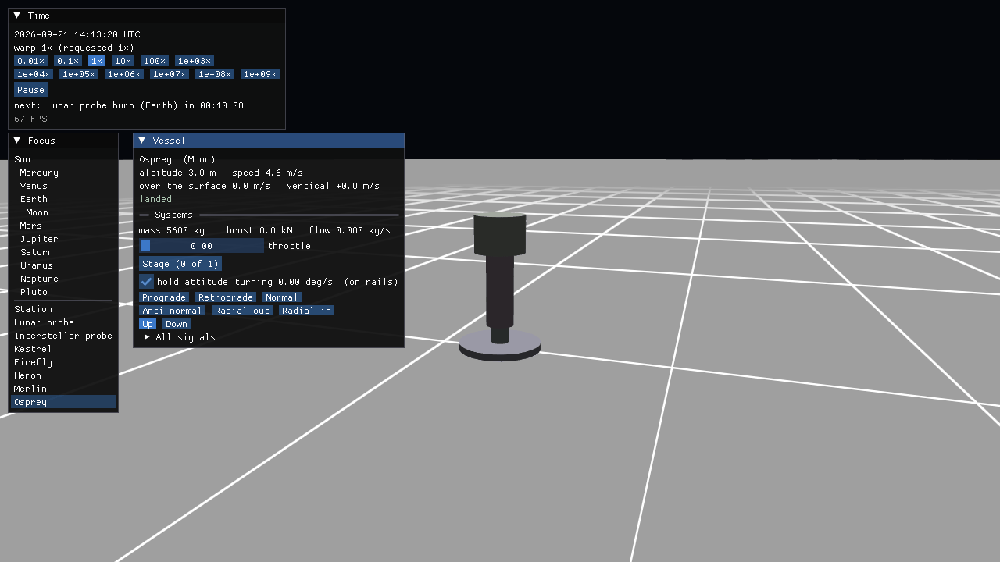
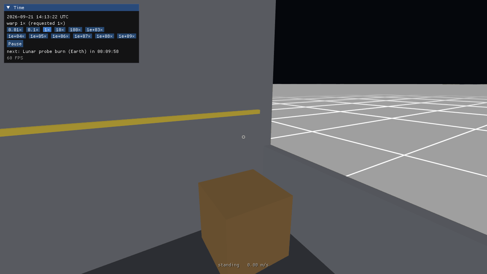
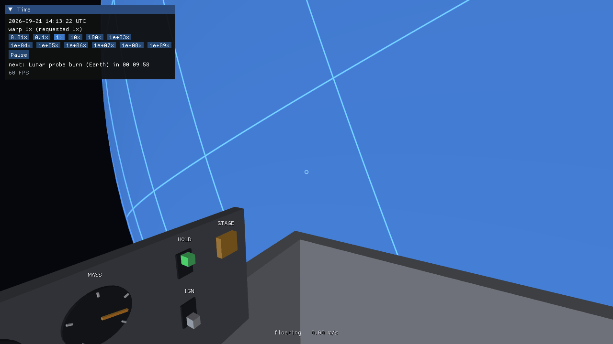
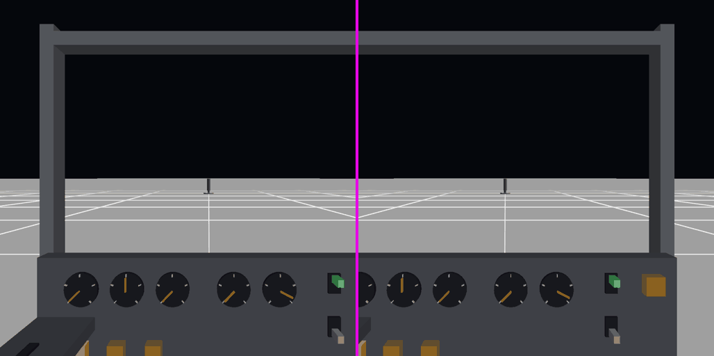

# Flight view (Phase 4)

The vessel being flown, seen from its seat or from outside, with controls that work. Everything
on screen is provisional: there are no models, so parts are cylinders and a cockpit is a few
boxes, and the ground is a smooth sphere with a grid on it. What is not provisional is how it
is put together, which is what a real interior and VR will stand on (BRIEFING §12, D26).

| | |
|---|---|
|  |  |
| *Osprey* on the Moon, from its seat: *Heron* stands 60 m ahead | *Merlin* in a 420 km orbit, the Earth below the floor |



*Osprey from the camera that circles it. The panels of the map view are still there (F2 hides
them).*

## Running it

```sh
./build/client/apps/helios/helios --focus Osprey --view cockpit   # a lander, standing on the Moon
./build/client/apps/helios/helios --focus Merlin --view cockpit   # an orbiter
./build/client/apps/helios/helios --focus Kestrel --view outside  # any vessel made of parts
```

Or start in the map, focus a vessel (click it in the *Focus* panel, or tab) and press `M`.

| Control | |
|---|---|
| `M` | map ↔ flight view |
| `C` | cockpit ↔ outside (a vessel without a seat only has the outside) |
| drag | cockpit: turn the head · outside: circle the vessel |
| wheel | outside: closer / further |
| click, drag on an instrument | throw a switch, press a button, move a lever |
| shift / ctrl | throttle up / down · `Z` full · `X` cut |
| `W` `S` | nose down / up · `A` `D` yaw left / right · `Q` `E` roll left / right |
| enter | next stage · `T` attitude hold on / off |
| F2 | show / hide the *Focus* and *Vessel* panels |
| `F` | whatever the prompt in the picture says: leave the seat, sit down, pick up, let go |
| `P` | pause (space too, except out of the seat) |

The steering keys turn the vessel as the pilot sees it from the seat: in Osprey, whose pilot
faces sideways with the nose overhead, `A` and `D` turn the vessel about its own long axis. They
work the reaction wheels directly and win over the attitude hold while they are down; with
*HOLD* on, the vessel then turns back to where it was pointed, so switch it off to fly by hand.

**A first flight.** `--focus Osprey --view cockpit`. Press *STAGE* (or enter): the engine is
armed, *IGN* goes green. Drag the throttle lever on the console to the left, or hold shift:
above 57 % the lander lifts off. Watch *V/S* and *ALT*; the grid on the ground is 10 m to a
cell near the surface and widens as you climb. Come back down at less than 6 m/s.

## Out of the seat

| | |
|---|---|
|  |  |
| *Petrel* on the Moon: standing in the habitat, looking back at the crate and a window | *Albatross* in orbit: floating by the controls, the Earth outside |

```sh
./build/client/apps/helios/helios --focus Petrel --view cockpit      # a habitat on the Moon: walk
./build/client/apps/helios/helios --focus Albatross --view cockpit   # the same in orbit: float
```

Press `F` to leave the seat. The mouse is then captured and turns the pilot; the ring in the
middle of the picture is the hand. `F` is the one key for doing things: the picture always
says what it would do now (`[F] sit down`, `[F] pick up the crate`), and a line at the bottom
says what the other keys do as things stand.

| Control, out of the seat | |
|---|---|
| mouse | look (floating: the whole body turns, any way up) |
| hold the mouse button | take hold of the surface under the ring, if it is within reach (the ring grows) |
| `W` `S` `A` `D` | standing: walk · holding on: move the body against the hand |
| space / ctrl | holding on: up / down · standing: space jumps |
| `F` on a loose item | pick it up (from up to 1.6 m: the pilot bends for it); `F` again lets go of it |
| click with an item in hand | throw it where you look; you go the other way |
| `Q` `E` | roll, when floating |
| click an instrument | works as from the seat |
| `F` near the seat | sit down, from within a metre of it |

**Nothing moves the pilot but what the pilot touches** (BRIEFING §12, D27). In *Albatross* the
keys do nothing in mid-air. Look at the window ahead, hold the button, pull yourself in with
`W`, then push away with `S`: when the arm is straight the hand lets go and you fly across the
room at the speed of the push, until you meet the far wall. Take hold of that to stop.

There are two loose things in the habitat, a 10 kg crate and a 3 kg toolbox. Stranded in the
middle of the room with nothing in reach, throw one: the crate leaves at 4 m/s and sends you
back at 0.44 m/s; the toolbox leaves faster and moves you less. They have weight when the
vessel has: on the Moon they lie on the floor, and in orbit they hang where they were left
until the engine is lit.

Weight comes from what the vessel feels, not from where it is. Light *Albatross*'s engine
(*STAGE*, then the throttle lever) while floating and the floor comes up to meet you: 0.4 g at
full throttle. In *Petrel* you stand at a sixth of a g from the start, and a jump takes you to
the ceiling.

The pilot is part of what moves: pushing off sends the vessel the other way with the same
momentum (a few millimetres per second for a 7 t vessel), as long as the vessel is flown at up
to 4× warp. The flight keys do not work out of the seat; the instruments do, by hand.

## In a headset

`helios --vr --focus Osprey` draws the pilot's view for a headset as well as in the window
(BRIEFING D29). It needs Windows, the Direct3D 11 renderer (chosen by `--vr`) and an OpenXR
runtime; without one it stops and says so. The head is where the headset is, about the seat's
eye point, or about the pilot's eyes out of the seat (where the hand then goes where the head
is turned). Keys fly the vessel as before; there are no hands yet, and the map and outside
views show nothing in the headset.

Without a headset, the build has a stand-in (BRIEFING §12.2): an OpenXR runtime of our own that
hands out images, keeps the head still and can save what each eye was sent.

```
set XR_RUNTIME_JSON=<repo>\build\client\tools\helios_xr_null.json
set HELIOS_XR_NULL_DUMP=eye
helios --vr --focus Osprey --frames 60
```

writes `eye_left.bmp` and `eye_right.bmp` (frame 20 unless `HELIOS_XR_NULL_DUMP_FRAME` says
otherwise; `HELIOS_XR_NULL_YAW_DEG` turns the head). Each eye sees further outwards than towards
the nose, so the two pictures are not centred alike:



## How it is put together

- **A cockpit is data.** A crewed part has a `[part.cockpit]` table in its datasheet
  (`data/parts/README.md`): where the pilot's eyes are and which way the seat faces, the boxes
  around it, and the instruments. An instrument names a signal of the control bus
  (`engine/throttle`, `nav/altitude_m`); it does not know what the vessel is made of, and in a
  vessel without that signal it is dead.
- **Flight instruments read the bus.** The simulation reports `nav/altitude_m`,
  `nav/vertical_speed_m_s`, `nav/surface_speed_m_s` and `nav/speed_m_s` on every vessel's bus,
  next to what the parts report. A dial, an autopilot and a script will read the same thing.
- **Input is actions, then signals** (`apps/helios/flight_controls.hpp`). Keys are bound to
  actions (*throttle up*, *pitch up*); actions and handled instruments become commands on the
  bus from the *Pilot* source. A hand in VR will handle the same instruments.
- **The head is relative to the seat** (`render::HeadPose`, BRIEFING §12.1 rule 2). Mouse-look
  produces a head pose; a headset produces a `TrackedPose`, which places the camera the same way.
- **Geometry is GPU-free** (`source/render/flight_geometry.cpp`), like the map view's: a
  snapshot goes in and camera-relative floats come out (solids, the ground patch, where each
  instrument is and what it reads), so it is tested in every CI job. `render::gpu::SolidRenderer`
  draws it into the view that `MapRenderer` set up, with the same reversed-Z depth.
- **The ground** is a cap of the body's sphere, rebuilt around the camera every frame: exact
  below the camera (positions are worked out in doubles relative to it), finer towards the
  point below, and reaching the horizon. The body's coarse sphere is not drawn while the cap
  is. The grid is the body's own latitude and longitude, drawn by the shader, so it turns with
  the body and shows the speed over the ground.

## Known limitations

- **The instruments' names and numbers are drawn over the picture**, not on the panel. Rule 3
  of BRIEFING §12.1 wants them in the world (rendered to a texture on the instrument); that
  needs text in the 3-D renderer and comes with the first real panel.
- **No shadows and no hull.** From the seat the part's own hull is not drawn, so the cabin is
  open to the sky and the star lights it from any side.
- **Out of the seat** the body is a ball (it has no arms or legs to see, and does not crouch),
  an item in hand is carried rigidly (it does not catch on things), and only the stock habitat
  is a cabin: the pod and the lander are no bigger than their seats. EVA and VR are still to
  come.
- Screenshot runs open a window that takes the keyboard: keys typed elsewhere meanwhile end up
  in it.
- **Parts without a shape are not drawn** (the solar panels of *Firefly*).
- The altitude is that of the centre of mass above the body's mean radius: 3 m when Osprey
  stands on its legs.
- Mouse and keys only; no gamepad or joystick yet, and the keys are not rebindable from a file.
