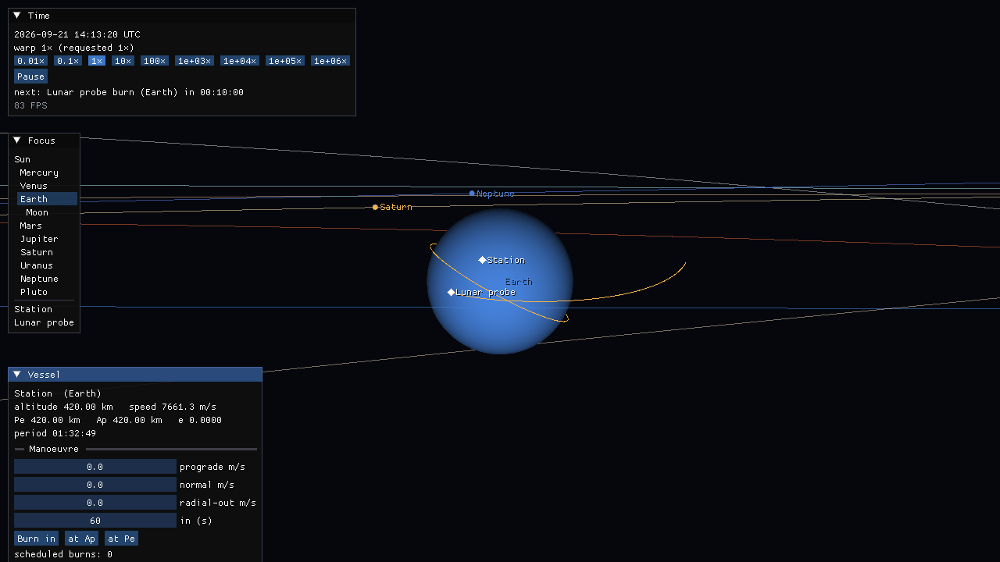
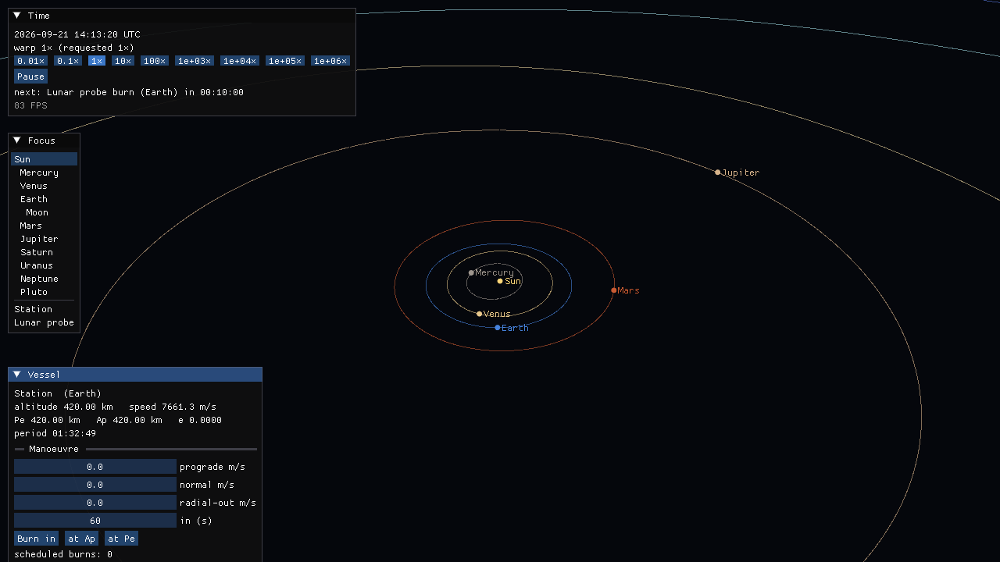
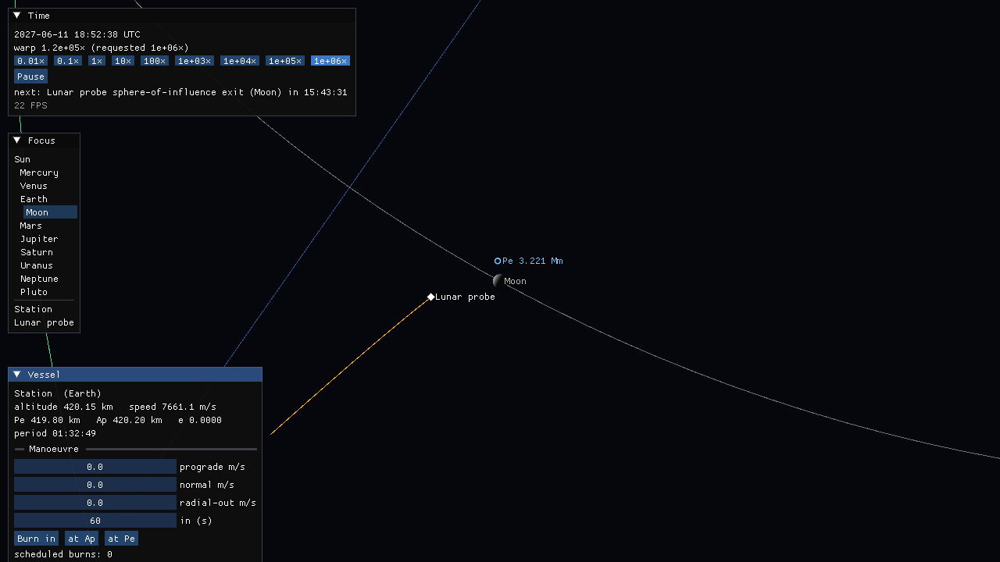

# Map view (Phase 2)

The first renderer: the stock Solar System, vessels and their predicted paths, and time warp from
0.01× to 10⁹×. The screenshots on this page were rendered in software (Mesa llvmpipe, OpenGL,
under Xvfb), exactly as the Linux client job in CI does; on macOS the same code runs on Metal.

| | |
|---|---|
|  |  |
| Earth, with the station's orbit and the lunar probe's planned translunar path | The inner planets, focused on the Sun; labels follow the sphere-of-influence hierarchy |



*The demo's lunar probe just past periapsis, 3,221 km above the Moon (whose phase is lit
correctly). The trajectory changes colour at each sphere-of-influence change, and warp is
held back ahead of the next event.*

## Running it

```sh
cmake --preset client && cmake --build --preset client
./build/client/apps/helios/helios                   # real time, now, focused on Earth
./build/client/apps/helios/helios --focus Moon --warp 5
```

| Control | |
|---|---|
| drag | orbit the camera around the focus |
| wheel | zoom (from just above the surface to 10¹⁶ m) |
| `,` / `.` | slower / faster warp (0.01×, 0.1×, 1×, 10×, … 10⁹×) |
| space | pause |
| tab | next focus (bodies, then vessels); or click in the *Focus* panel |
| F1 | controls help |

The *Vessel* panel schedules impulsive burns in prograde / normal / radial-out components,
after a delay or at the next apoapsis / periapsis. Other flags: `--ephemeris <de421.hce>`
(exact DE421 instead of mean elements), `--start-unix <s>`, `--renderer metal|vulkan|opengl|d3d11|d3d12`,
`--size WxH`, and for reproducible runs `--frames N --screenshot out.png [--hold-warp]` (fixed
1/60 s ticks on the main thread).

## How it is put together

```
 simulation thread (120 Hz)                           render thread (vsync)
 ┌──────────────────────────┐   SceneSnapshot    ┌───────────────────────────────┐
 │ Simulation::advance(dt)  │ ─────────────────▶ │ build_frame_geometry          │
 │  ├ TimeWarp (event-lim.) │  (immutable,       │  (double → camera-relative    │
 │  ├ Encke propagators     │   focus-relative   │   float: floating origin)     │
 │  └ events + predictions  │   doubles)         │ MapRenderer (bgfx, reversed-Z)│
 │ commands ◀─ UI / input   │ ◀───────────────── │ ImGui panels + labels         │
 └──────────────────────────┘   posted lambdas   └───────────────────────────────┘
```

- **Headless boundary.** `source/sim` and everything below it know nothing about GPUs or
  windows. `sim::build_snapshot` produces positions as doubles relative to the focus; the
  renderer subtracts its camera offset (also a double) and only then rounds to float
  (`render::to_camera_space`), so nothing on the GPU is ever larger than the view needs.
- **Depth.** A reversed-Z projection with an infinite far plane and a 32-bit float depth
  buffer (`render::reversed_infinite_projection`): uniform precision in log distance, from
  the near plane to infinity.
- **VR-ready (BRIEFING §12.1).** `MapRenderer::draw` takes a `ViewCamera` and a `ViewTarget`
  and is called once per view; stereo is two calls with per-eye view and projection matrices.
- **Time warp.** `sim::TimeWarp` only moves the clock; trajectories are warp-invariant (D14).
  The requested factor is reduced continuously so the next burn, sphere-of-influence change or
  impact stays at least 0.5 s of wall time away, which makes the approach an exponential ramp
  (≈ 7 s from 10⁶× to real time, 10 s from 10⁹×) that lands exactly on the event. Reaching a
  burn or an impact drops the requested warp to real time.
- **Up to 10⁹× (D21).** At that warp one 120 Hz tick is 96 days. What makes it affordable is
  the analytic regime: a weakly perturbed orbit (the demo's station) follows its exact conic
  with no integration steps, however many revolutions a tick spans; strongly perturbed
  trajectories are still integrated, which is cheap when their periods are long (the demo's
  *Interstellar probe*). A vessel on a short, perturbed orbit (geostationary, around the Moon)
  costs integration steps in proportion to the warp; if a tick takes longer than its wall-time
  slot the simulation falls behind instead of taking longer steps, and the *Time* panel shows
  the warp actually achieved. Use a Release build (`--preset client-release`) for the top
  levels: a Debug build integrates about ten times slower.
- **Predictions are exact.** The map line is not a conic: it is sampled from a copy of the
  vessel's own propagator (`dynamics::predict_trajectory`), so it is the path the vessel will
  follow, perturbations and scheduled burns included.
- **Events** (`dynamics::predict_conic_events`) are closed-form on the osculating conic
  (apsides, sphere-of-influence exit, impact) plus a conservative step-and-bisect search for
  entry into a moon's sphere. They schedule warp, nothing else; the propagator decides when
  a domain actually changes. In the demo the conic predicts the Moon's sphere-of-influence
  entry 2 % late (the Moon's pull is not in the conic), which is why the limiter keeps a margin.
- **Impacts at any warp.** A frame at 10⁶× can carry a vessel through a planet, so the end
  state alone cannot detect an impact; when one is predicted within the frame, the path is
  searched (conservative stepping and bisection on copies of the propagator).

## Dependencies

bgfx (with shaderc), SDL3 and Dear ImGui are fetched at pinned commits by
[`cmake/HeliosClientDependencies.cmake`](../../cmake/HeliosClientDependencies.cmake) and only
built with `HELIOS_BUILD_CLIENT=ON` (the `client` presets). Shaders
(`source/render/gpu/shaders`) are compiled by shaderc at build time for the platform's back-ends
(Metal on macOS; Vulkan and OpenGL on Linux; D3D11/12, Vulkan and OpenGL on Windows) and
embedded in the executable.

## Known limitations

- Bodies are flat-coloured spheres; no textures, atmospheres or rings yet.
- Lines are 1 px (bgfx line primitives); screen-space thick lines come with the UI pass.
- The first build compiles bgfx's shader compiler (~7 min on 4 cores).
- VR is not wired yet. OpenXR has no runtime on macOS, so the VR spike (1b) needs Linux or
  Windows; the renderer already draws a list of views.
