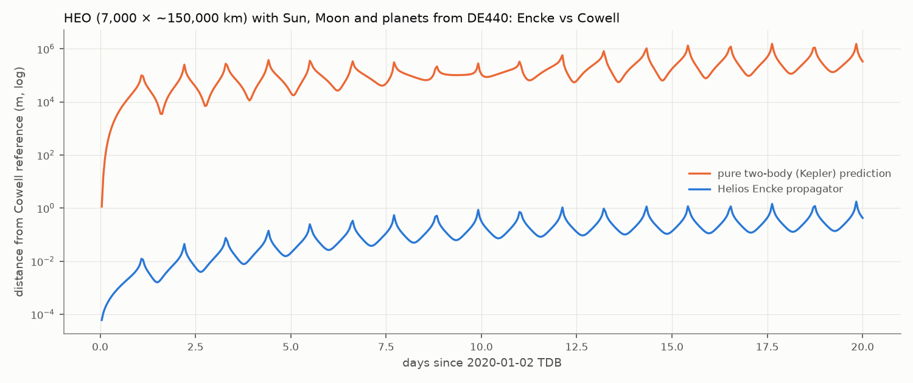
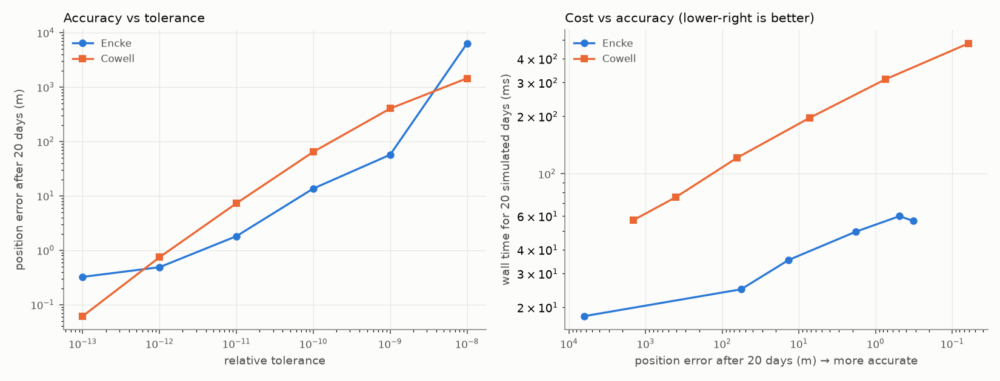
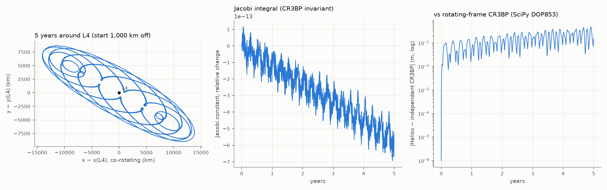
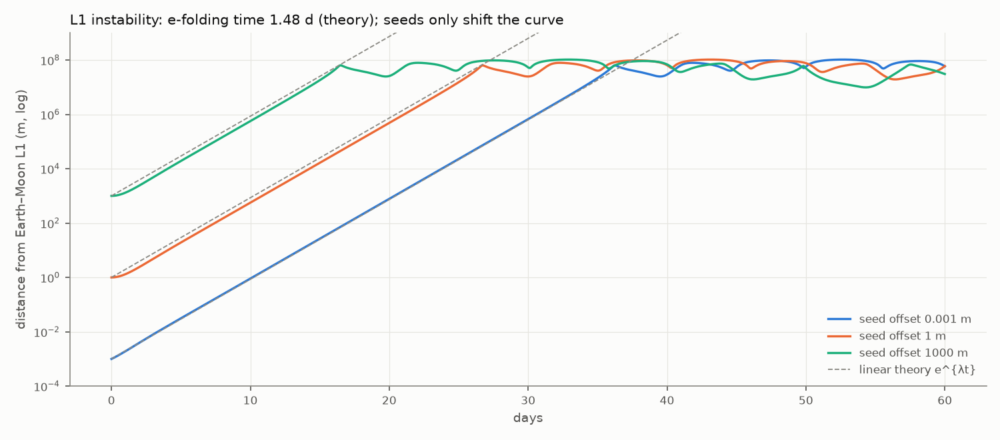
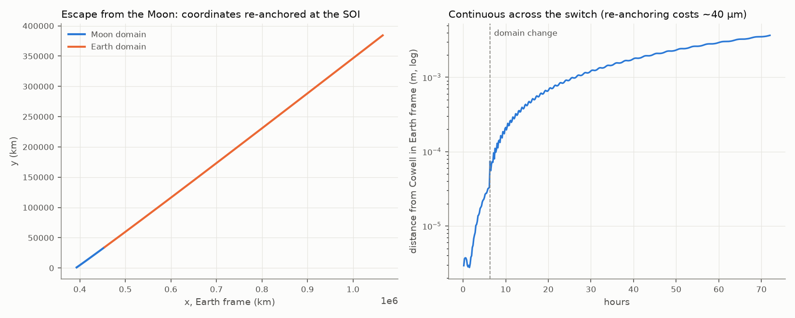
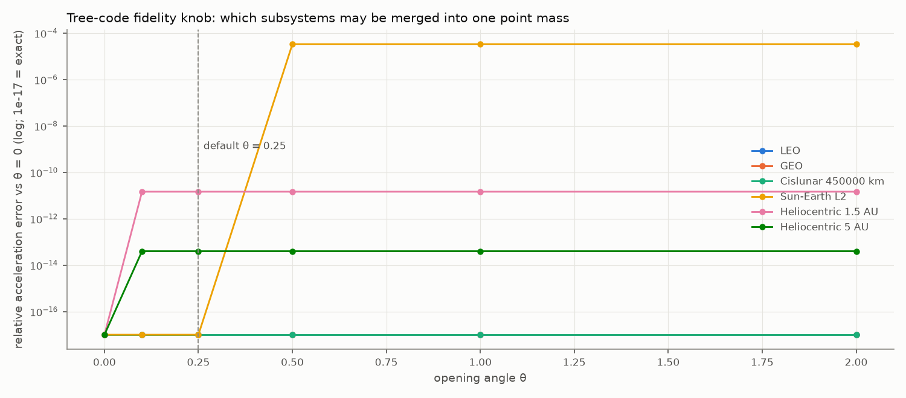

# Dynamics validation: frames, gravity and vessel propagation

**Status:** Phase 1. Generated by `tools/dynamics_scenarios` (C++, the real propagator) and
`tools/dynamics/plot_dynamics.py`. Companion to the [ephemeris validation](../ephemeris/README.md).

## What is being validated

| Component | Code | Role |
|---|---|---|
| Rotating frames | `frames::BodyRotation` | IAU-style closed-form body orientation; inertial ↔ body-fixed states (incl. ω×r) |
| Body catalogue | `bodies::BodyCatalog`, `data/solar_system/bodies.csv` | μ, radius, sphere-of-influence *domain* hierarchy, rotation |
| Tree-code gravity | `dynamics::GravityModel` | Barnes–Hut opening criterion over the frame tree + indirect term (BRIEFING §4.3, §5.2) |
| Vessel propagation | `dynamics::EnckePropagator` | Encke deviations from a universal-variable conic, Dormand–Prince 5(4), dense output, rectification, domain switching |
| Reference | `dynamics::propagate_cowell` | Direct integration of r̈, an independent formulation |

## Summary

| Test | Result |
|---|---|
| Encke vs Cowell, 20-day HEO with real Sun/Moon/planets (DE440) | ≤ **1.8 m**, while ignoring perturbations would be off by **1,552 km** |
| Cost at equal accuracy | Encke is **3–5× cheaper** than Cowell (fig. 2) |
| Warp invariance (BRIEFING D14) | **Bit-identical** trajectories sampled every minute or once per 30 days (up to 1.6e8× warp) |
| L4 libration, 5 years (CR3BP) | Jacobi constant conserved to **7e-13**; matches an independent rotating-frame CR3BP integration to **0.49 m** after 5 years |
| L1 instability (CR3BP) | Growth rate = linear theory within **0.4 %** for seeds from 1 mm to 1 km |
| Domain switch Moon → Earth | Continuous: ≤ **3.7 mm** from a Cowell run in the Earth frame |
| Gravity evaluation cost | ≈ **4 µs** per acceleration in the full Solar System tree |

## 1. Encke vs Cowell in the real Solar System

A highly elliptical Earth orbit (perigee 7,000 km, apogee ~150,000 km) from 2020-01-02 TDB,
with every DE440 body selected by the tree code. The reference is Cowell's method integrated
hour by hour at a relative tolerance of 1e-13.



Pure Kepler motion drifts by up to 1,550 km within 20 days: the Moon's pull at apogee matters.
Encke stays within 1.8 m of the reference. The spikes are perigee passages, where any
along-track error shows up as distance fastest.

### Tolerance sweep: accuracy and cost

Final error after 20 days against a tighter Cowell reference (2e-14, 120 s max step), Release build (MSVC, Ryzen 7 5800X):

| Relative tolerance | Encke error (m) | Encke steps | Encke time (ms) | Cowell error (m) | Cowell time (ms) |
|---|---|---|---|---|---|
| 1e-08 | 6,344.41 | 415 | 18 | 1,447.77 | 57 |
| 1e-09 | 56.95 | 586 | 25 | 402.77 | 75 |
| 1e-10 | 13.60 | 870 | 35 | 64.33 | 121 |
| 1e-11 | 1.81 | 1,255 | 50 | 7.29 | 196 |
| 1e-12 | 0.49 | 1,605 | 60 | 0.74 | 312 |
| 1e-13 | 0.32 | 1,737 | 57 | 0.06 | 481 |



Encke reaches a given accuracy with 3–5× less work, because it only integrates the
small deviation from the conic. The default tolerance (1e-12) gives ~0.5 m after 20 days.
**Open item:** Encke plateaus at ~0.3 m (2e-9 relative) for tolerances below 1e-12. The
interpolation and the rectification threshold have been ruled out; the likely candidates are
conic-solver rounding and time-argument precision. It is far below what gameplay needs, but it is
worth a look when long-duration planning (Phase 6) arrives.

## 2. Warp invariance (BRIEFING §7.1, D14)

The same 30-day orbit, perturbed by the Moon, sampled at different cadences. "Equivalent warp"
assumes one sample per 60 Hz frame.

| Sampling cadence | Equivalent warp | Samples | Max difference vs 60 s cadence (m) | Integrator steps |
|---|---|---|---|---|
| 60 s | 3,600× | 43,200 | 0 | 2,199 |
| 3,600 s | 216,000× | 720 | 0 | 2,199 |
| 86,400 s | 5,184,000× | 30 | 0 | 2,199 |
| 2,592,000 s | 155,520,000× | 1 | 0 | 2,199 |

The step sequence depends only on the dynamics and the tolerances. Samples are interpolated
inside completed steps, and rectification or domain changes happen only at step boundaries. So
**the trajectory is literally the same bits at any warp**, which is the property that stops
KSP-style "it explodes at high warp" behaviour.

## 3. Lagrange points (circular restricted three-body problem)

The Earth–Moon CR3BP is built from the normal machinery: two circular Keplerian ephemerides
about their barycentre, with the vessel propagated in the Earth domain.

### L4: stable libration, conserved invariant, independent cross-check



* Starting 1,000 km off L4 and at rest in the rotating frame, the vessel librates in a bounded
  tadpole (max 15,868 km from L4) for 5 years.
* The Jacobi integral drifts by at most 7e-13 (relative).
* The same initial condition integrated with the textbook non-dimensional rotating-frame CR3BP
  equations (SciPy DOP853, rtol 1e-13) agrees to 5 cm after one year and
  0.49 m after five.
* Found while building this report: starting **10,000 km** off L4 at rest in the rotating
  frame is *outside* the stable region. The vessel escapes after ~9 days and is later flung out by
  the Moon. The independent integrator confirms it, so it is real physics, not a bug. It is also a
  good gameplay note: "parking near L4" needs the right velocity, not just the right place.

### L1: the instability rate is physics, the seed is numerics



This answers the concern from the time-warp discussion (BRIEFING §7.1). A vessel placed near L1
drifts away at the rate predicted by linearising the CR3BP: λ = 0.6752/day
(e-folding time 1.48 days). Measured: 0.001 m → 0.6754/d, 1 m → 0.6760/d, 1000 m → 0.6779/d. Changing the initial
offset by six orders of magnitude only shifts the curve in time. Numerical error can only change
the seed, never the growth rate, so station-keeping or auto-park (BRIEFING §7.1, D15) is the right
answer, not tighter integration.

## 4. Domain (sphere-of-influence) switching



A vessel escaping the Moon at 3 km/s is re-anchored from the Moon's frame to Earth's frame when it
crosses 1.05 × the Moon's sphere of influence (hour 6.3). A Cowell run done entirely
in Earth's frame agrees to 3.7 mm over 3 days. The re-anchoring
itself costs ~40 µm, from re-osculating the conic in the new frame.

## 5. The tree-code fidelity knob



Relative acceleration error against the fully opened tree (θ = 0), at six places.

* LEO, GEO and the cislunar probe sit at the exact floor (all three lines overlap) for every θ:
  they are inside the Earth–Moon system, which is always opened for them.
* Heliocentric probes can merge the Earth–Moon pair into one point with errors of 1e-11 to 1e-13.
* **Sun–Earth L2** is where it matters. From 1.5 million km beyond Earth, the pair spans
  ~0.34 rad, so θ ≥ 0.5 merges it and the Moon's individual pull is lost (3e-5 relative error).
  That is why the default is **θ = 0.25**.
* Cost is ~4 µs per evaluation regardless of θ in the Solar System (few nodes). The knob will
  matter for procedural systems with many moons.

## 6. Unit tests backing this (all run in CI)

* Conic propagation: elliptic vs the element solution, hyperbolic energy and angular momentum
  conservation plus reversal, near-parabolic convergence.
* Rotation: Earth's stellar day, 23.44° obliquity in ecliptic axes, and a geostationary orbit
  holding its longitude to < 0.001° for 30 days.
* Body catalogue: parsing, domain hierarchy, rejection of bad rows, and the stock Solar System
  loading (Earth sphere of influence 0.925 million km).
* Gravity: exact sums, aggregation of distant subsystems, and LEO on real DE440 feeling only the
  ~1e-6 m/s² tide (the Sun's 5.9e-3 m/s² cancels through the indirect term).
* Propagator: exactness without perturbations, bit-identical warp sampling, Encke vs Cowell on
  DE440, Moon → Earth domain change, L4 plus Jacobi, and L1 growth rate.

## Reproducing

```sh
cmake -S . -B build/release -G Ninja -DCMAKE_BUILD_TYPE=Release -DHELIOS_BUILD_TESTS=OFF
cmake --build build/release
./build/release/tools/helios_dynamics_scenarios test/data/de440_2020_excerpt.hce \
    data/solar_system/bodies.csv build/validation/dynamics          # ~5 s
python tools/dynamics/plot_dynamics.py build/validation/dynamics docs/validation/dynamics
```

## Not yet validated

Thrust and finite burns, atmosphere and drag (and auto-park, D15), non-spherical gravity (J2),
worldline recording and ghosts: next phases.
