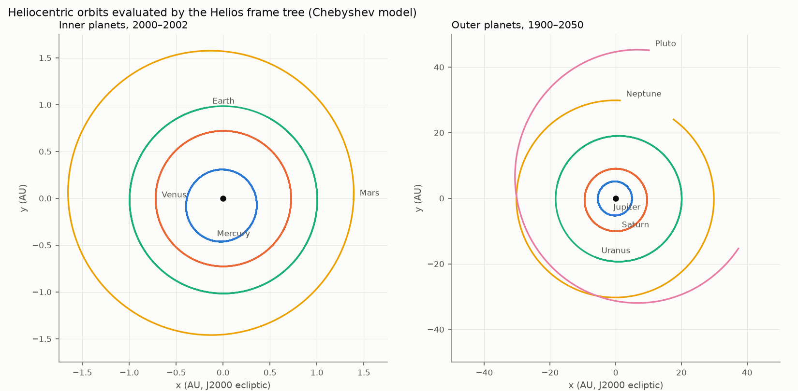
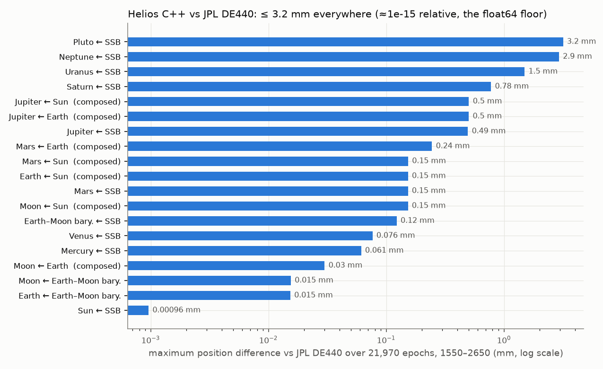
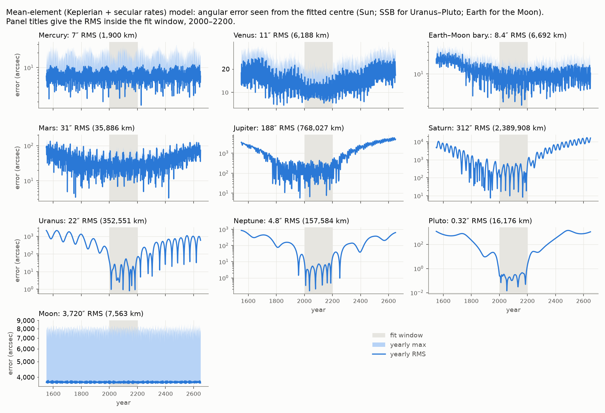
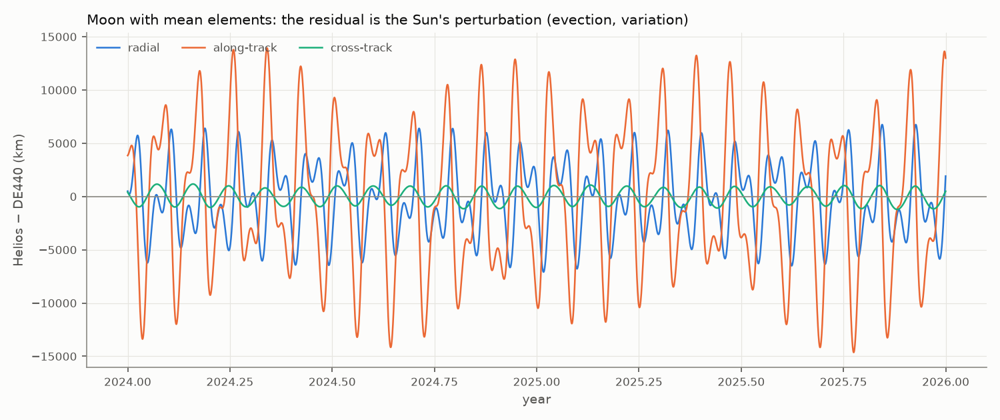

# Ephemeris validation: Helios vs JPL DE440

**Status:** Phase 1, reference frames and large-body models. Generated by
`tools/ephemeris/validate.py`; every Helios number below was computed by the **C++ code**
(`helios_ephemeris_probe`, which builds a `helios::frames::FrameTree`), never by a Python port.

**Reference:** JPL DE440 (Park, Folkner, Williams & Boggs 2021), 1550–2650, downloaded from JPL
and evaluated independently with `jplephem`. Axes: J2000 ecliptic. Time: TDB seconds since
J2000. Units: SI.

## Summary

| Model | What it is for | Result against DE440 |
|---|---|---|
| **Chebyshev** (`ChebyshevEphemeris`) | The real Solar System (stock universe) | ≤ **3.2 mm** for every body over 1,100 years (≈1e-15 relative: the float64 floor). Accelerations consistent with the true derivative to ≤ 7e-9 (the finite-difference floor). |
| **Frame tree** (`FrameTree::relative_state`) | Relative states between any two frames | Compositions through the lowest common ancestor add no error: Moon ← Earth 0.03 mm, Mars ← Earth 0.25 mm. |
| **Mean elements** (`KeplerianEphemeris`) | The default stock universe, procedural systems, planning | Fitted on 2000–2200. In that window: inner planets **7–31″** RMS, Jupiter/Saturn **190–310″**, Uranus–Pluto **0.3–22″**, Moon **≈1°** (7,600 km). Outside it the model extrapolates and the error grows (section 3). |

In short: the Chebyshev path is a faithful, numerically exact carrier of JPL's ephemeris. The
closed-form mean-element path behaves exactly as Keplerian theory predicts, including its known
failure modes.

**From DE421 to DE440.** Helios used DE421 (2009, 1900–2050) until 2026-10-01. DE440 is JPL's
current general-purpose ephemeris and covers 1550–2650. At the epochs of the golden test (early
2020) the two differ by 2.4 m for the Moon relative to Earth, 121 m for Earth relative to the
Sun and 331 m for Mars relative to the Sun. The gravitational parameters in
`data/solar_system/bodies.csv` now come from JPL's `gm_de440.tpc`; they changed by a few parts
per million at most, except the Pluto system (−0.15 %).

## 1. Orbits



## 2. Chebyshev model and frame composition

About 22,000 epochs: 20,000 uniformly random over 1550–2650 with random sub-second fractions,
plus about 2,000 exact 4-day record boundaries of the lunar series spread over the whole span,
where discontinuities would show. "Segment" rows compare one exported DE440 segment directly.
"Composed" rows ask the frame tree for a pair that is not stored anywhere, so the relative state
has to be summed through their lowest common ancestor.



| Target | Observer | Kind | Max Δr (mm) | RMS Δr (mm) | Max Δr / r | Max Δv (m/s) |
|---|---|---|---|---|---|---|
| Sun | SSB | segment | 0.000959 | 0.000163 | 8.4e-16 | 1.3e-14 |
| Mercury | SSB | segment | 0.0612 | 0.011 | 8.8e-16 | 5.1e-11 |
| Venus | SSB | segment | 0.0765 | 0.0187 | 7.0e-16 | 2.9e-11 |
| Earth–Moon bary. | SSB | segment | 0.123 | 0.031 | 8.3e-16 | 2.6e-11 |
| Earth | Earth–Moon bary. | segment | 0.0153 | 0.0073 | 3.5e-12 | 3.0e-12 |
| Moon | Earth–Moon bary. | segment | 0.0155 | 0.00728 | 4.3e-14 | 3.4e-12 |
| Mars | SSB | segment | 0.153 | 0.0392 | 6.6e-16 | 2.2e-11 |
| Jupiter | SSB | segment | 0.494 | 0.13 | 6.2e-16 | 9.3e-12 |
| Saturn | SSB | segment | 0.776 | 0.235 | 5.6e-16 | 5.8e-12 |
| Uranus | SSB | segment | 1.5 | 0.451 | 5.4e-16 | 6.4e-12 |
| Neptune | SSB | segment | 2.93 | 0.625 | 6.5e-16 | 3.7e-12 |
| Pluto | SSB | segment | 3.17 | 0.884 | 6.4e-16 | 3.1e-12 |
| Moon | Earth | composed | 0.03 | 0.0103 | 8.2e-14 | 5.8e-12 |
| Earth | Sun | composed | 0.153 | 0.0343 | 1.0e-15 | 2.9e-11 |
| Moon | Sun | composed | 0.153 | 0.0343 | 1.0e-15 | 2.9e-11 |
| Mars | Earth | composed | 0.245 | 0.0556 | 2.4e-15 | 4.4e-11 |
| Mars | Sun | composed | 0.154 | 0.0418 | 7.3e-16 | 2.2e-11 |
| Jupiter | Sun | composed | 0.504 | 0.142 | 6.6e-16 | 1.1e-11 |
| Jupiter | Earth | composed | 0.502 | 0.144 | 7.8e-16 | 3.1e-11 |

(Jupiter to Pluto are the planetary-system barycentres, as in DE440.)

The error grows with distance from the origin at a constant ~1e-15 relative level. That is
double-precision rounding, not a modelling error. The one exception to the 1e-15 level is Earth ← EMB (3.5e-12 relative):
the Earth sits only ~4,700 km from the Earth–Moon barycentre, so a 15 µm rounding error is
large *relative to that short vector*, but still only 15 µm.

### Accelerations (the frames' indirect term, BRIEFING §4.3)

The frame tree's acceleration is the analytic second derivative of the Chebyshev series.
It is compared with a central difference (±60 s) of JPL's own velocity:

| Pair | Typical \|a\| (m/s²) | Median relative diff. | Max relative diff. |
|---|---|---|---|
| Moon ← Earth | 0.00272 | 4.3e-09 | 6.7e-09 |
| Earth ← Sun | 0.00593 | 3.5e-11 | 7.4e-11 |
| Mars ← Sun | 0.00251 | 1.4e-11 | 4.8e-11 |
| Jupiter ← Sun | 0.000218 | 7.4e-11 | 3.2e-10 |

The residual is the finite difference's own truncation error, ≈ (n·h)²/6. For the Moon,
n ≈ 2.7e-6 rad/s and h = 60 s, which gives 4e-9, exactly the level observed. So the analytic
acceleration is at least that good.

## 3. Mean-element (Keplerian + secular rates) model

Twelve parameters per body (six elements at J2000 plus six linear rates), fitted by least
squares on position to DE440 over **2000–2200** (`tools/ephemeris/fit_mean_elements.py`, output
`data/solar_system/mean_elements.csv`). Evaluated every 5 days over all of DE440. This is the
model the game uses unless it is given the exported ephemeris (`--ephemeris`).



| Body | Fitted around | RMS error (″) | Max (″) | RMS (km) | Max (km) | RMS over 1550–2650 (″) |
|---|---|---|---|---|---|---|
| Mercury | Sun | 7.0 | 28.9 | 1,900 | 6,450 | 7.2 |
| Venus | Sun | 10.9 | 26.4 | 6,188 | 13,852 | 15.2 |
| Earth–Moon bary. | Sun | 8.4 | 23.4 | 6,692 | 16,971 | 12.4 |
| Mars | Sun | 30.9 | 99.9 | 35,886 | 100,475 | 46.7 |
| Jupiter | Sun | 187.7 | 446.0 | 768,027 | 1,620,618 | 2,069.6 |
| Saturn | Sun | 312.2 | 623.9 | 2,389,908 | 4,607,300 | 5,221.1 |
| Uranus | SSB | 22.4 | 66.6 | 352,551 | 929,789 | 713.5 |
| Neptune | SSB | 4.8 | 16.8 | 157,584 | 433,988 | 274.3 |
| Pluto | SSB | 0.3 | 1.8 | 16,176 | 56,975 | 542.0 |
| Moon | Earth | 3,720.0 | 8,402.3 | 7,563 | 14,908 | 3,722.9 |

The first four number columns are inside the fit window; the last is over all of DE440.

How to read this:

* **Inner planets (7–31″).** A single Kepler ellipse per planet, with slowly drifting elements,
  already reaches arc-second level, and holds it for the whole 1,100 years. The residual is the
  planets' mutual perturbations.
* **Jupiter and Saturn (190–310″ in the window, degrees outside it).** Their 5:2 near-resonance,
  the "great inequality" with a period of about 900 years, cannot be represented by linear
  rates. JPL's published approximate elements (Standish) show errors of the same order for these
  two planets. It needs periodic terms, or the Chebyshev model.
* **Uranus, Neptune, Pluto: fit them around the barycentre.** Fitted heliocentrically, they showed
  ~850,000 km errors. That is the Sun's own reflex motion around the Solar System barycentre,
  about one solar radius, driven by Jupiter and Saturn. The outer planets effectively orbit the
  barycentre, so fitting them there cuts the error 4–13×. This is recorded as a data decision in
  the fitter. Their periods (84–248 years) are comparable to the fit window, so linear rates
  fit the window very well and extrapolate poorly.
* **Moon (≈1°).** Expected. The Sun perturbs the lunar orbit strongly: evection (1.27°,
  31.8 days), variation (0.66°, half a synodic month) and the annual equation. The residual is
  mostly along-track:



RMS by component over 2024–2025: radial 3,374 km, along-track 6,772 km,
cross-track 704 km.

### Why the fit window is 2000–2200

Linear rates extrapolate poorly, so the window should be the period the elements are used in.
The game starts at the present and runs forward. RMS position error (km) of fits made on
different windows, scored on the coming century:

| Scored over 2000–2100 | fit 1900–2050 (the DE421 window) | fit 1950–2150 | fit 1900–2200 | **fit 2000–2200** |
|---|---|---|---|---|
| Mercury | 1,876 | 1,876 | 1,876 | 1,876 |
| Venus | 6,323 | 6,246 | 6,331 | 6,203 |
| Earth–Moon bary. | 6,741 | 6,695 | 6,819 | 6,656 |
| Mars | 36,650 | 36,648 | 36,722 | 36,672 |
| Jupiter | 775,310 | 728,992 | 729,871 | 723,004 |
| Saturn | 2,524,092 | 2,390,783 | 2,407,785 | 2,344,366 |
| Uranus | 1,415,164 | 770,115 | 1,013,983 | 244,413 |
| Neptune | 1,458,358 | 162,559 | 333,560 | 120,487 |
| Pluto | 334,080 | 28,210 | 115,318 | 15,470 |

Fitting on 2000–2200 is the best or tied for every body, and for Uranus, Neptune and Pluto it is
6–22 times better than the old window, which ended in 2050. Over the rest of DE440 (to 2650) no
candidate window is consistently better. Far beyond DE440 the mean elements are all there is:
they stay bounded (each body remains on a slowly precessing ellipse) but are no longer a
prediction of where the real planets will be.

**Consequence for the design.** Real-universe bodies use the Chebyshev model where it exists.
Mean elements are for procedural systems, where no "truth" exists and the Keplerian orbit *is*
the definition, and as a cheap, unbounded fallback outside the Chebyshev coverage. A moon of a
procedural planet around a procedural star is exactly Keplerian by construction.

## 4. Unit tests backing these results

Run by `ctest`. The ones relevant here:
* Kepler equation residual < 1e-13 for e ∈ [0, 0.999] over the whole M range.
* Vis-viva, angular momentum and orbit orientation invariants; state ↔ elements round trip,
  including the circular and equatorial conventions.
* Keplerian acceleration = d(velocity)/dt; the orbit closes after 100 periods to < 1 m.
* Chebyshev series reproduces an analytic uniformly-accelerated motion, its velocity and its
  acceleration.
* Frame tree: composition, antisymmetry, error paths, and **precision far from the root**. A Moon
  400,000 km from Earth, 8 kpc from the galactic root, is exact through the lowest common
  ancestor, while the naive root-relative difference is off by more than 1 km.
* **DE440 golden test**: a 19 KB excerpt of the exported ephemeris (`test/data`) reproduces
  jplephem states for Moon ← Earth, Earth ← Sun and Mars ← Sun to < 1 mm and < 1e-9 m/s
  (golden values from `tools/ephemeris/golden_states.py`).

Rotating frames, vessel propagation, Lagrange-point dynamics and warp invariance are validated
in the [dynamics report](../dynamics/README.md).

## Reproducing

```sh
python3 -m venv .venv && . .venv/bin/activate
pip install -r tools/ephemeris/requirements.txt
# de440.bsp (114 MB): https://naif.jpl.nasa.gov/pub/naif/generic_kernels/spk/planets/de440.bsp
#   sha256 a4ce9bf9b3282becc9f4b2ac3cebe03a2ae7599981aabd7265fd8482fff7c4b5
# gm_de440.tpc (masses): https://naif.jpl.nasa.gov/pub/naif/generic_kernels/pck/gm_de440.tpc
#   sha256 924ddf4fb9ead9fe8a1aa55780bcabde40b09d00065d58226e24b68d8092f140
cmake --preset debug && cmake --build --preset debug
cd tools/ephemeris
python export_de_chebyshev.py de440.bsp de440.hce                  # ~110 MB, not committed
python export_de_chebyshev.py de440.bsp ../../test/data/de440_2020_excerpt.hce \
    --start-year 2020.0 --end-year 2020.15                         # the committed excerpt
python golden_states.py de440.bsp                                  # values of the golden test
python fit_mean_elements.py de440.bsp ../../data/solar_system/mean_elements.csv
python validate.py --probe ../../build/debug/tools/helios_ephemeris_probe --kernel de440.bsp \
    --hce de440.hce --elements ../../data/solar_system/mean_elements.csv \
    --work ../../build/validation --out ../../docs/validation/ephemeris
```

This report was produced on 2026-10-01 from the kernel downloaded from JPL (checksum above),
with jplephem 2.24, NumPy 2.1.2 and SciPy 1.16.2.

Provenance of the earlier DE421 data: the container that produced it could not reach JPL and
used the `de421.bsp` shipped in the `skyfield-data` package on PyPI. That file is not
byte-identical to JPL's `de421.bsp` (their checksums differ), but JPL's file reproduces the
DE421 golden values that were committed exactly, so the data was the same ephemeris.
